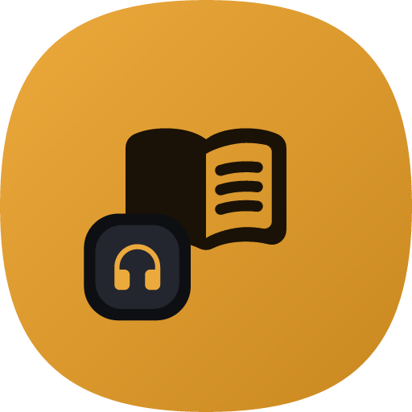

<p align="center">
  
</p>

<h1 align="center">Samra · سَمْره</h1>

<p align="center">
  <b>Your audiobooks & e-books — downloaded, owned, and played offline.</b><br>
  A private companion for your Storytel library. Arabic-first · English · dark & light.
</p>

---

## What is Samra?

**Samra** is a personal app for **downloading the audiobooks and e-books you already
have access to** on Storytel, and **listening to / reading them offline** in a clean,
fast, bilingual interface.

It signs into **your own** account and saves **your** content to **your** device — then
gives you a proper in-app **player** and **reader** on top of it, so you never lose your
place. Everything stays local: no extra accounts, no tracking, no cloud.

> Samra is for content you have the legitimate right to access (your subscription or
> public-domain works). It is **not** a DRM / paywall bypass.

The brand mark — an **open book with a headphones badge** on a warm saffron tile —
reflects the two things Samra does: **read** and **listen**.

---

## Features

### 📥 Download
- Sign into Storytel and download your audiobooks and e-books for offline use.
- Paste one or more links; Samra detects and queues them automatically.
- Choose output format (MP3 / M4B / M4A / Opus), combine chapters, skip existing.

### 🎧 Audiobook player
- In-app playback with chapters, **playback speed**, and a **sleep timer**.
- **Resume** — reopens exactly where you stopped, per book.
- **Bookmarks** — save spots and jump back to them anytime (saved across restarts).

### 📖 E-book reader (EPUB / PDF)
- Adjustable **font, theme (paper/sepia/night), and spacing**.
- **Highlights, notes, and freehand pen** annotations.
- **Resume** the last page/chapter + **bookmarks**, per book.

### 🌍 Designed & personal
- Fully **bilingual** — العربية (RTL) and English — with **dark & light** themes.
- One unified squircle app icon across launcher, onboarding, and brand.
- Your credentials and reading state are stored **only on your device**.

---

## Platforms

| | Platform | Stack | Status |
|---|---|---|---|
| 📱 | **`android/`** | Kotlin · Jetpack Compose (Material 3) · Media3 · Chaquopy (bundled Python engine) | **Shipping** |
| 💻 | **`pc/`** | Python · Flet (desktop) · packaged Windows installer | **Working** |
| 🎨 | **`design/`** | App-icon + design-system assets | — |
| 🍎 | **`ios/`** | _planned_ | Placeholder |

---

## Project structure

```
Samra/
├─ android/   Native Android app (the primary, fullest experience)
├─ pc/        Windows desktop app (Flet) + installer
├─ design/    Brand & design-system assets (app icon, tokens)
├─ ios/       Placeholder for a future iOS app
└─ assets/    Repo assets (icon used in this README)
```

---

## Build

**Android** — open `android/` in Android Studio, or:
```bash
cd android && ./gradlew :app:assembleRelease
```
Requires JDK 17+, the Android SDK, and Python 3.12 (Chaquopy `buildPython`). Signing
material and machine-specific paths are kept out of the repo (`keystore.properties`,
`local.properties`).

**PC** — Python 3.12 + Flet:
```bash
cd pc && pip install -r requirements.txt && python run.py
```

---

<p align="center"><sub>Private project · for personal, offline use with content you own.</sub></p>
